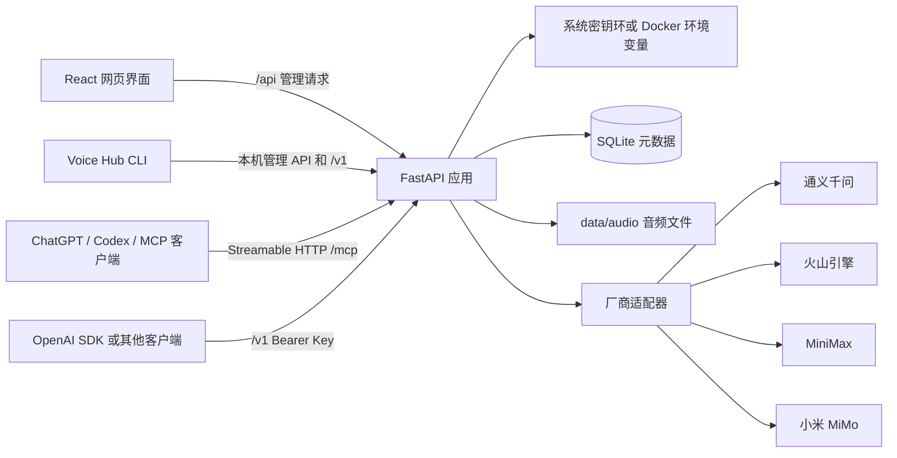
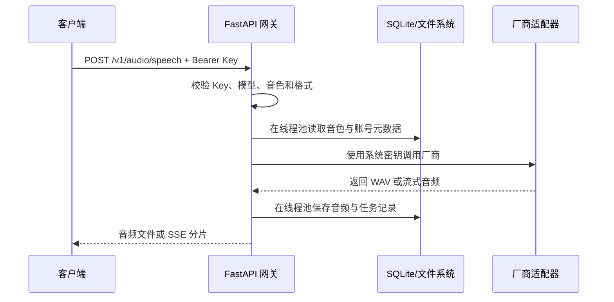

# 架构说明

Voice Hub 是单机优先的 React + FastAPI 云端语音聚合应用。浏览器只访问本机后端，后端通过远程 API 调用语音厂商；应用本身不加载或运行本地语音模型。厂商密钥不会进入前端代码，也不会由浏览器直接发送到厂商。

## 目录职责

| 目录或文件 | 职责 |
| --- | --- |
| `frontend/src/App.tsx` | 应用外壳、导航和已访问页面的实例保留 |
| `frontend/src/context/StudioContext.tsx` | 模型、音色、任务、网关和合成状态的共享上下文 |
| `frontend/src/pages/` | 合成、音色、克隆、设计、网关、历史和设置页面 |
| `frontend/src/components/` | 页面间复用的业务组件、模型别名设置、确认弹窗和互斥音频播放器 |
| `frontend/src/audioPlayback.ts` | 合成、设计、网关测试和历史试听共用的全应用音频互斥控制器 |
| `frontend/src/styles.css` | 原生 CSS 界面、响应式布局、全局焦点样式和减少动效处理 |
| `backend/app/main.py` | FastAPI 装配、中间件、异常处理、lifespan 和静态文件服务 |
| `backend/app/cli.py` | 无第三方运行时依赖的 CLI HTTP 客户端、参数校验和可读输出 |
| `backend/app/mcp_server.py` | MCP 工具、Skills 扩展、音频返回上限和 `/mcp` 子应用 |
| `backend/app/routers/` | 账号、音色、任务、网关、存储和系统接口 |
| `backend/app/services.py` | 模型解析、厂商适配器选择、音频转换和共享业务逻辑 |
| `backend/app/database.py` | SQLite 连接策略、schema 版本、迁移和初始数据 |
| `backend/app/config.py` | 版本、端口、路径、官方 Endpoint 和本机安全边界 |
| `backend/app/providers/` | 各厂商 TTS、流式、克隆和设计能力的适配器 |
| `backend/app/credentials.py` | 系统密钥环和 Docker 环境变量凭据读取/保存 |
| `backend/app/storage.py` | 存储策略、容量统计和自动清理计划 |
| `backend/tests/conftest.py` | pytest 临时根目录、凭据环境清理和外网访问拦截 |
| `voicehub.cmd` | Windows 源码、轻量版和便携版共用的 CLI 启动入口 |
| `skills/voice-hub-tts/` | 供 Agent 扫描或本地安装的 Voice Hub CLI/MCP 决策 Skill |
| `data/voice_studio.db` | 任务、音色、厂商账号元数据；不保存完整 API Key |
| `data/audio/` | 生成音频、参考音频和设计试听文件 |
| `data/logs/` | 启动器和运行时日志；升级时与其他用户数据一并保留 |

## 一次合成请求

流式接口会优先使用厂商原生流式能力；不支持原生流式的模型由后端完成兼容转换。每次网关请求都会记录状态、延迟、模型和错误代码，但不会记录厂商密钥。

前端将网关使用与全局配置分开：API 网关页只负责 Gateway Key、快速开始、接口文档、测试和统计；`tts-default`、`tts-fast`、`tts-hq` 的绑定由设置页“默认模型”中的 `ModelAliasSettings` 管理。音色库使用单行六列结构展示音色、`api_voice_id`、模型名称、短模型 ID、类型和语言。`api_voice_id` 优先取厂商真实 `provider_voice_id`，厂商没有永久 Voice ID 时才回退到唯一 `public_name`；兼容网关同时接受唯一短模型 ID、完整 `provider/model` ID 和模型别名。

异步路由中的 SQLite、音频文件读写、元数据读取和 FFmpeg 转换通过线程池执行，避免阻塞 FastAPI 事件循环。应用启动和自动存储清理由 FastAPI lifespan 管理。

## 凭据与安全边界

- Windows 使用 Windows Credential Manager，macOS 使用 Keychain，Linux 使用 Secret Service/KWallet。
- Docker 使用 `.env` 或部署平台 Secret，并以只读文件系统、非 root 用户、丢弃 Linux capabilities 和 `no-new-privileges` 运行。
- `/v1/*` 接口必须携带 Gateway Key；默认服务地址只监听 `127.0.0.1`。
- 自定义厂商 Endpoint 默认只允许官方域名；启用自定义 Endpoint 时应确保目标可信，否则厂商 Key 可能被发送到错误服务。
- 音频路径在读取、下载和清理前都会校验其位于 `data/audio` 目录内。
- 账号元数据与系统密钥环发生跨存储写入时会保留旧凭据快照；SQLite 操作失败会执行补偿恢复，降低两边状态分裂的风险。
- CLI 在环回地址调用时可通过受限的本机管理接口取得 Gateway Key；远程地址不会自动读取 Key，必须显式提供 `VOICE_HUB_API_KEY`，且默认拒绝通过远程明文 HTTP 传输凭据。
- MCP 与 WebUI 共用端口，通过 Streamable HTTP `/mcp` 提供；它不返回 Gateway Key、厂商 Key 或服务器音频路径，也不开放账号管理、音色删除、更新和克隆/设计管理工具。
- `create_speech` 是唯一会主动访问远程厂商的 MCP 工具，标记为非只读、非破坏性、开放世界操作；其余 MCP 工具均为只读。大音频受 `VOICE_STUDIO_MCP_MAX_AUDIO_BYTES` 限制。
- 当前 MCP 没有公网 OAuth，只允许环回地址、受控私有通道或 Secure MCP Tunnel 使用。公开服务需要单独设计 OAuth、限流和多用户隔离。

## 存储生命周期

任务元数据保存在 SQLite，音频单独保存在 `data/audio`。存储策略可以按保留天数和容量上限生成清理计划；默认只清理音频，任务文字记录继续保留。选择“任务记录”范围时，相关任务和音频会一起删除。

旧版本曾在 `backend/` 或 `data/` 根目录生成日志。应用启动时会把这些已知旧日志迁移到 `data/logs/`；若存在同名文件则使用带时间戳的旧版文件名，原日志不会被覆盖。

## 扩展厂商

新增厂商通常需要：

1. 在 `backend/app/providers/` 增加实现 `base.py` 约定的适配器。
2. 在 `config.py` 和 `services.py` 注册默认 Endpoint、模型列表和能力标记。
3. 为同步、克隆、设计或流式能力补充对应测试。
4. 在前端模型选择和设置页面补充显示信息。

适配器应将厂商错误转换为 `ProviderError`，避免把密钥、完整上游响应或内部路径写入用户可见错误。

## 测试隔离

后端测试必须从 `backend` 目录使用 pytest 运行。`tests/conftest.py` 会在导入应用前设置临时 `VOICE_STUDIO_ROOT`、移除真实厂商凭据环境变量并阻止非本机网络连接，因此测试不会写入真实 `data/`，也不会调用厂商计费接口。

## 应用装配与生命周期

`backend/app/main.py` 创建 `FastAPI(title="Voice Hub Gateway", version=config.APP_VERSION)`，统一挂载 `system`、`accounts`、`voices`、`gateway`、`jobs` 和 `storage` 路由，并在 SPA catch-all 之前加入 MCP 的精确 `/mcp` 路由。若 `frontend/dist` 存在，则挂载 `/assets` 并用最后的 catch-all 路由返回 SPA 的 `index.html`；因此 API 与 MCP 路由必须继续在静态 SPA 路由之前注册。

应用 lifespan 的启动顺序是：创建 `data/audio` 与 `data/logs`、迁移已知旧日志、初始化 SQLite schema、执行一次到期清理、启动 MCP Streamable HTTP session manager，然后启动每小时一次的后台清理任务。关闭时按相反顺序退出，避免 MCP 子应用已挂载但 session manager 未运行。运行时根目录由 `VOICE_STUDIO_ROOT` 决定，默认是仓库根目录；端口由 `VOICE_STUDIO_PORT` 决定，默认 `8765`。

## 部署与 CI 边界

Dockerfile 使用 Node 22 构建前端、Python 3.12 运行后端，并以非 root `voice` 用户启动 Uvicorn。Compose 将宿主机端口绑定到 `127.0.0.1`，只读挂载 `./data`，容器根文件系统只读，并通过 `GET /api/summary` 健康检查。镜像构建和 Compose 配置校验由 `.github/workflows/ci.yml` 覆盖。推送 `v*.*.*` 标签后，`.github/workflows/release.yml` 构建 Windows、Linux、macOS 发布包并创建 GitHub Release，`.github/workflows/docker-publish.yml` 独立构建并推送 `linux/amd64`、`linux/arm64` 的 GHCR 镜像。

当前源码基线已验证：后端 `python -m pytest -q tests` 为 81 项通过；前端 `npm run lint`、`npm test`（2 个文件、9 项）和 `npm run build` 均通过。CI 还会在三种操作系统上验证测试与系统密钥环，但这些检查不替代目标机器上的桌面密钥环和 FFmpeg 实机诊断。

